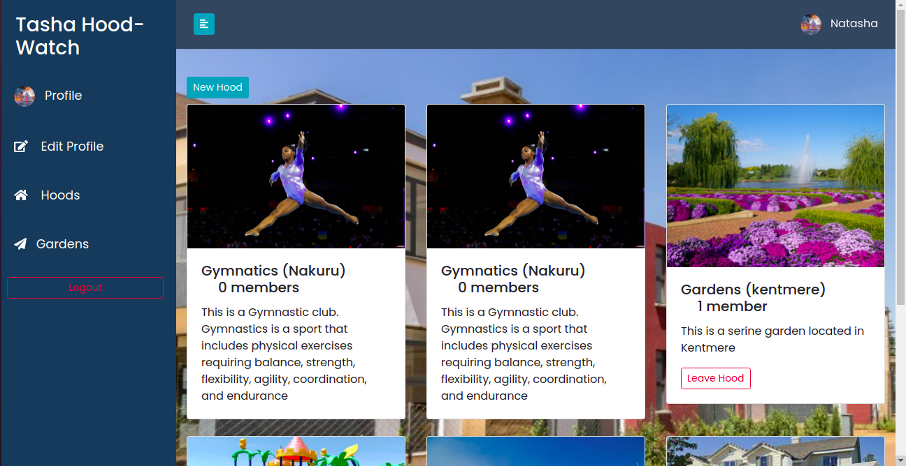

# Tasha HoodWatch

---



---

# Description  
This is a neighborhood app where a user must signup first, be able to join a hood owned by the hood admin, and once you 
join a hood, one can see businesses and posts in only that hood they belong to.  

## User Story  
  
* Sign in with the application to start using.
* Set up a profile about me and a general location and my neighborhood name.
* Find a list of different businesses in my neighborhood.
* Find Contact Information for the health department and Police authorities near my neighborhood.
* Create Posts that will be visible to everyone in my neighborhood.
* Change My neighborhood when I decide to move out.
* Only view details of a single neighborhood.
  
## Setup and Installation  


##### Install and activate Virtual  

- python3 -m venv virtual - source virtual/bin/activate  
```  
##### Install Dependencies  
 ```bash 
 pip install -r requirements.txt 
```  
 ##### Setup Database  
  SetUp your database User,Password, Host then make migrate  
 ```bash 
python manage.py makemigrations hood
 ``` 
 Now Migrate  
 ```bash 
 python manage.py migrate 
```
##### Run the application  
 ```bash 
 python manage.py runserver 
``` 
##### Testing the application  
 ```bash 
 python manage.py test 
```
Open the application on your browser `127.0.0.1:8000`.  
  
## Contact Information   
kinuthianatasha@gmail.com 

---

### License
  
* LICENSED UNDER  [](license/MIT)
 